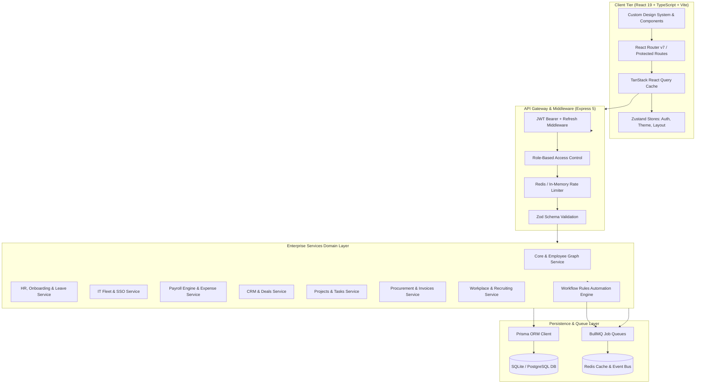

# Unified Workforce OS — Enterprise HR, IT & Finance in One Platform

[](https://www.typescriptlang.org/)
[](https://react.dev/)
[](https://nodejs.org/)
[](https://expressjs.com/)
[](https://www.prisma.io/)
[](https://vite.dev/)
[](https://bullmq.io/)
[](https://www.docker.com/)
[](LICENSE)

> A modern, full-stack enterprise operating system that unifies **Human Resources, Zero-Trust IT Management, Real-time Payroll & Finance, CRM, Project Management, and Workflow Automation** into a single cohesive platform.

---

## Table of Contents

- [Overview & Problem Statement](#overview--problem-statement)
- [Architecture & Design System](#architecture--design-system)
  - [System Architecture](#system-architecture)
  - [Dual Theme Design System](#dual-theme-design-system)
- [Module Directory](#module-directory)
  - [1. Core Workforce Graph](#1-core-workforce-graph)
  - [2. HR & People Operations](#2-hr--people-operations)
  - [3. IT Asset Management & Zero-Trust Cloud](#3-it-asset-management--zero-trust-cloud)
  - [4. Finance, Payroll & Expense Management](#4-finance-payroll--expense-management)
  - [5. CRM & Revenue Pipeline](#5-crm--revenue-pipeline)
  - [6. Project Boards & Sprint Velocity](#6-project-boards--sprint-velocity)
  - [7. Procurement & Vendor Ledger](#7-procurement--vendor-ledger)
  - [8. Workplace, ATS & Knowledge Wiki](#8-workplace-ats--knowledge-wiki)
  - [9. Event-Driven Workflow Automation Studio](#9-event-driven-workflow-automation-studio)
  - [10. Executive Cross-Domain BI Analytics](#10-executive-cross-domain-bi-analytics)
- [Technology Stack](#technology-stack)
- [Repository Structure](#repository-structure)
- [Getting Started](#getting-started)
  - [Prerequisites](#prerequisites)
  - [Environment Setup](#environment-setup)
  - [Database Initialization & Seeding](#database-initialization--seeding)
  - [Running the Application](#running-the-application)
  - [Default Test Credentials](#default-test-credentials)
- [Docker & Containerized Deployment](#docker--containerized-deployment)
- [REST API Reference](#rest-api-reference)
- [Code Quality & Build Verification](#code-quality--build-verification)
- [Git Setup & Push Instructions](#git-setup--push-instructions)
- [License](#license)

---

## Overview & Problem Statement

Modern growing companies typically subscribe to 8 to 15 fragmented SaaS tools to manage their workforce:
- **HRIS & Payroll:** Workday, BambooHR, Gusto
- **IT Device Management:** Jamf, Kandji, JumpCloud
- **Expense & Invoicing:** Expensify, Ramp, Brex
- **Identity & SSO:** Okta, Google Workspace, Azure AD
- **Project Tracking:** Jira, Asana, Monday.com
- **Customer CRM:** HubSpot, Salesforce

This fragmentation creates **data silos, manual duplicate entry, security gaps upon offboarding, and massive SaaS subscription waste**.

**Unified Workforce OS solves this with a Single Source of Truth — The Unified Employee Graph:**
When a team member is onboarded, their corporate hardware is registered with zero-touch MDM, their SSO application catalog is provisioned, their compensation profile enters the payroll calculation engine, and their virtual corporate card is created — all through an automated workflow. When an employee is offboarded, a single click revokes SSO tokens, wipes devices, and closes active expense accounts immediately.

---

## Architecture & Design System

### System Architecture



### Dual Theme Design System

The client is built on a bespoke, highly refined design system following **Linear, Vercel, and modern enterprise aesthetics**:
- **Obsidian Dark Mode (`[data-theme="dark"]`, `.dark`):** Deep obsidian slate backgrounds (`#0B0F19`, `#111827`, `#0D111D`), subtle glassmorphism borders (`#1F2937`), luminous indicator dots, and high-contrast typography (`#F9FAFB`, `#94A3B8`).
- **Luminous Light Mode:** Soft blue-gray canvas (`#F0F4FA`), crisp white cards (`#FFFFFF`), subtle drop shadows, and rich indigo accents (`#2563EB`).
- **Interactive Header Theme Switcher:** One-click Sun/Moon toggle with instantaneous DOM attribute resolution and local storage persistence.
- **Space Optimization:** Tight 20px / 24px vertical rhythm that eliminates dead margins and vertical scroll fatigue.
- **Executive Panoramic Header:** Integrated live status chips (`Systems Normal`, `Active Tasks`, `Pending Approvals`, `Events`) balanced across the viewport without awkward voids.

---

## Module Directory

### 1. Core Workforce Graph
- **Unified 360° Profile:** Comprehensive employee dossiers containing personal data, employment history, assigned hardware, software entitlements, payroll compensation, and emergency contacts.
- **Dynamic Org Chart:** Interactive organizational hierarchy visualizing direct reports, executive management trees, and department headcount.
- **Company Directory:** Filterable by department, employment status, search term, and toggleable between a responsive grid and an enterprise data table.

### 2. HR & People Operations
- **Zero-Touch Onboarding Builder:** Visual drag-and-drop step orchestrator using `@dnd-kit` with step-by-step role assignment, hardware provisioning triggers, and legal document checklists.
- **Self-Service Step Wizard:** Multi-stage onboarding wizard guiding new hires through contact info, tax compliance, benefits, and hardware preferences.
- **Time Off & Leave Management:** Balance calculators (PTO, sick leave, parental leave), multi-level approval workflows, and company holiday calendars.
- **Documents & Electronic Signatures:** Legal document distribution (Offer Letters, NDAs, W-4s) with e-signature tracking and compliance status.
- **Performance Reviews & OKRs:** Goal tracking sliders with progress percentages, owner attribution, and 360 performance review evaluation forms.
- **Benefits Enrollment:** Tiered medical, dental, 401(k), and wellness stipends with real-time deduction calculation.

### 3. IT Asset Management & Zero-Trust Cloud
- **Hardware Fleet MDM:** Inventory tracking for MacBook Pros, ThinkPads, and monitors with remote lock (`MDM PIN`), wipe, and status tracking.
- **1-Click App SSO Catalog:** Provision access to Google Workspace, GitHub, Slack, AWS, Jira, and Figma with automatic role assignment.
- **Zero-Trust Security Policies:** Fleet-wide enforcement of FileVault full-disk encryption, biometric WebAuthn/MFA, and auto-lock screen policies.
- **IT Service Desk:** Ticket queue with categorization (Hardware, Access, Software, Security), priority tags, and resolution workflows.

### 4. Finance, Payroll & Expense Management
- **Real-Time Payroll Calculation Engine:** Automated gross-to-net calculations factoring in federal/state tax withholdings, FICA/Medicare, 401(k) pre-tax contributions, and employer matches.
- **PDF Payslip Generator:** Instant vector PDF download generation using `jsPDF` for monthly pay stubs.
- **Expense Reimbursements:** Multi-currency expense submissions with OCR receipt attachment, category tagging, and manager approvals.
- **Corporate Virtual Cards:** Real-time card issuance, masked account generation, spending limits, and transaction feeds.
- **Subscription & Billing:** Enterprise tier management (`Starter`, `Business Pro`, `Enterprise Elite`), seat usage calculator, and invoice history table.

### 5. CRM & Revenue Pipeline
- **Deal Pipeline Stages:** Visual deal funnel (`Lead`, `Discovery`, `Demo`, `Proposal`, `Negotiation`, `Closed-Won`).
- **Customer Accounts:** Corporate client accounts with revenue tracking, contact roles, and contract renewals.

### 6. Project Boards & Sprint Velocity
- **Project Workspaces:** Milestone tracking, sprint deadlines, budget allocation, and health indicators.
- **Task Management:** Priority tagging (`Urgent`, `High`, `Medium`, `Low`), assignee avatars, due date alerts, and completion tracking.

### 7. Procurement & Vendor Ledger
- **Vendor Registry:** Contract tracking, primary contacts, payment terms, and vendor risk tiers.
- **Purchase Orders (PO):** Multi-tier approval queue with budget thresholds and automated invoice reconciliation.
- **Invoices Lifecycle:** End-to-end tracking (`Draft` → `Sent` → `Pending` → `Paid` → `Overdue`).

### 8. Workplace, ATS & Knowledge Wiki
- **Biometric / Web Clock In & Out:** Employee attendance tracking with hours-worked calculation and team availability status.
- **Recruiting & ATS Pipeline:** Candidate applications (`Applied`, `Screening`, `Interview`, `Assessment`, `Offer`, `Hired`) with ratings and stage mutators.
- **Knowledge Base Wiki:** Searchable internal documentation with category filtering pills (`Engineering`, `Security`, `Compliance`, `Benefits`).
- **Learning & Compliance Courses:** Mandatory SOC2, cybersecurity, and HR compliance training tracks with progress meters.

### 9. Event-Driven Workflow Automation Studio
- **Trigger-Condition-Action Engine:** Event-driven automation built on top of BullMQ:
  - *Trigger:* `employee.hired` → *Action:* Create IT ticket, provision Google Workspace, assign default laptop.
  - *Trigger:* `employee.offboarded` → *Action:* Lock MDM devices, revoke SSO tokens, generate final payout slip.
  - *Trigger:* `expense.submitted` (> $5,000) → *Action:* Route to CFO for executive approval.

### 10. Executive Cross-Domain BI Analytics
- Consolidated dashboard analyzing:
  - Workforce headcount growth velocity
  - Hardware encryption compliance rate
  - SaaS license waste and unassigned seat cost
  - Monthly payroll burn vs. revenue

---

## Technology Stack

```
├── Frontend
│   ├── React 19 + TypeScript (Strict Mode)
│   ├── Vite 8.2 (Fast HMR & Optimized Chunks)
│   ├── TanStack React Query v5 (Cache & Mutations)
│   ├── Zustand (Auth & Theme Global State)
│   ├── Framer Motion (Micro-animations)
│   ├── Recharts (BI Data Visualizations)
│   ├── Lucide React (Clean iconography)
│   └── Vanilla CSS Token Design System (Dark/Light)
│
├── Backend
│   ├── Node.js 20+ with Express 5
│   ├── TypeScript (Compiled with strict tsconfig)
│   ├── Prisma ORM 5.22
│   ├── SQLite (Local Zero-Config) / PostgreSQL (Production)
│   ├── BullMQ + ioredis (Async Queues & Event Bus)
│   ├── Zod (End-to-end schema validation)
│   ├── Helmet + CORS + Compression
│   └── bcryptjs + jsonwebtoken (Dual JWT Auth)
│
└── Infrastructure
    ├── Docker & Docker Compose (Multi-stage builds)
    ├── Oxlint (Ultra-fast AST linting)
    └── TypeScript Project References
```

---

## Repository Structure

```
unified-workforce-os/
├── client/                               # Frontend React 19 Application
│   ├── index.html                        # HTML entry point with Google Fonts
│   ├── vite.config.ts                    # Vite build config with manual chunking
│   ├── tsconfig.json                     # Client TypeScript configuration
│   └── src/
│       ├── main.tsx                      # React root mount point
│       ├── App.tsx                       # Route declarations & QueryClient setup
│       ├── index.css                     # Global Design System tokens (Dark & Light)
│       ├── components/
│       │   ├── layout/                   # AppShell, Header, Sidebar
│       │   └── ui/                       # Avatar, Badge, Button, Card, DataTable,
│       │                                 # EmptyState, KPICard, Modal, StepWizard,
│       │                                 # Tabs, Timeline, Toaster, CommandPalette
│       ├── pages/                        # 25+ domain pages (Dashboard, Directory,
│       │                                 # ITDashboard, Finance, Billing, Onboarding,
│       │                                 # Recruiting, Performance, Knowledge, etc.)
│       ├── lib/                          # api.ts (HTTP client), types.ts, utils.ts
│       └── store/                        # auth.store.ts, theme.store.ts
│
├── server/                               # Backend Express API Server
│   ├── prisma/
│   │   ├── schema.prisma                 # Unified Employee Graph data model
│   │   └── seed.ts                       # Realistic enterprise demo data seeder
│   ├── src/
│   │   ├── app.ts                        # Express server entry point & shutdown
│   │   ├── worker.ts                     # BullMQ background worker process
│   │   ├── config/                       # env.ts, database.ts, redis.ts, logger.ts
│   │   ├── events/                       # event-bus.ts (Distributed pub/sub)
│   │   ├── middleware/                   # auth.ts, rbac.ts, validate.ts, rate-limit.ts
│   │   └── modules/                      # 9 Domain feature modules
│   │       ├── core/                     # Employees, auth, audit, notifications
│   │       ├── hr/                       # Leave, reviews, goals, benefits, docs
│   │       ├── it/                       # Devices, app catalog, security, tickets
│   │       ├── finance/                  # Payroll engine, expenses, cards
│   │       ├── crm/                      # Customers, deals, contacts
│   │       ├── projects/                 # Projects, tasks, milestones
│   │       ├── procurement/              # Vendors, POs, invoices
│   │       └── workplace/                # Attendance, ATS recruiting, wiki
│   ├── tsconfig.json                     # Server TypeScript configuration
│   ├── tsconfig.build.json               # Build tsconfig for production dist
│   └── package.json
│
├── docker-compose.yml                    # Local multi-service orchestration
├── docker-compose.prod.yml               # Production deployment configuration
├── .gitignore                            # Comprehensive ignore rules
└── README.md                             # Enterprise platform documentation
```

---

## Getting Started

### Prerequisites

- **Node.js**: `v20.0.0` or higher
- **npm**: `v10.0.0` or higher
- **Git**

### Environment Setup

1. Clone the repository or navigate to the project root:
   ```bash
   cd "d:/Unified Workforce OS — HR + IT + Finance in One Platform"
   ```

2. Configure backend environment variables:
   ```bash
   cd server
   cp .env.example .env
   ```
   *(The default SQLite setup in `.env` is pre-configured for instant zero-dependency local development).*

### Database Initialization & Seeding

Run Prisma schema push and database seeding from the `server` directory:

```bash
cd server
npm install
npx prisma db push
npx prisma db seed
```

This populates the SQLite database with:
- **30+ realistic employee profiles** across Engineering, Marketing, Sales, Product, and Finance
- **Hardware assets** (MacBooks, monitors, ThinkPads) enrolled with MDM PINs
- **Live payroll cycles, purchase orders, invoices, and expense claims**
- **Sprint tasks, OKRs, calendar events, and knowledge wiki guides**

### Running the Application

In development mode, launch both the API backend and Vite client:

```bash
# Terminal 1 — Start the Backend API (Port 4000)
cd server
npm run dev

# Terminal 2 — Start the Frontend Client (Port 5173)
cd client
npm run dev
```

Open your browser and navigate to **[http://localhost:5173](http://localhost:5173)**.

### Default Test Credentials

| Role | Email | Password | Access Level |
|---|---|---|---|
| **Executive / Super Admin** | `admin@uos.com` | `password123` | Full enterprise read/write access across all 9 modules |
| **HR Director** | `hr@uos.com` | `password123` | People, Onboarding, Leave, Documents, Benefits |
| **IT Security Lead** | `it@uos.com` | `password123` | Fleet MDM, SSO Provisioning, Security, Help Desk |
| **Staff Employee** | `employee@uos.com` | `password123` | Self-service profile, PTO, expenses, tasks |

---

## Docker & Containerized Deployment

To build and run the entire unified stack using Docker Compose:

```bash
# Build and launch all services (API, Client, PostgreSQL, Redis)
docker-compose up --build -d

# View logs
docker-compose logs -f
```

The services will be exposed at:
- Frontend: `http://localhost:5173` (or `80` in production)
- Backend API: `http://localhost:4000`

---

## REST API Reference

All requests must include `Authorization: Bearer <jwt-token>` (except public auth routes).

### Core & Authentication
| Method | Endpoint | Description |
|---|---|---|
| `POST` | `/api/core/auth/login` | Authenticate user & retrieve access + refresh JWT tokens |
| `POST` | `/api/core/auth/refresh` | Refresh an expired access token using refresh token |
| `GET` | `/api/core/employees` | Search and paginate employee graph directory |
| `POST` | `/api/core/employees` | Create workforce employee record |
| `GET` | `/api/core/employees/:id/profile` | Retrieve unified 360-degree employee dossier |
| `POST` | `/api/core/employees/:id/offboard` | Atomic offboarding lifecycle (revokes access, locks assets) |
| `GET` | `/api/core/stats` | Executive KPI aggregates and trend charts |
| `GET` | `/api/core/audit` | Live SOC-2 compliant immutable audit trail |

### HR & People
| Method | Endpoint | Description |
|---|---|---|
| `GET` | `/api/hr/leave` | Retrieve employee leave balances and requests |
| `POST` | `/api/hr/leave` | Submit PTO or sick leave request |
| `PATCH` | `/api/hr/leave/:id` | Approve or reject leave request |
| `GET` | `/api/hr/documents` | List legal compliance documents & e-signature status |
| `POST` | `/api/hr/documents/:id/sign` | E-sign document |
| `GET` | `/api/hr/reviews` | Retrieve 360 performance reviews & OKR goals |
| `PATCH` | `/api/hr/goals/:id/progress` | Update key result progress percentage |

### IT & Security
| Method | Endpoint | Description |
|---|---|---|
| `GET` | `/api/it/devices` | Retrieve hardware inventory and MDM enrollment |
| `POST` | `/api/it/devices/:id/lock` | Remotely lock endpoint device with MDM PIN |
| `POST` | `/api/it/devices/:id/wipe` | Trigger remote cryptographic device wipe |
| `GET` | `/api/it/catalog` | List enterprise SSO software application catalog |
| `POST` | `/api/it/access/provision` | Provision employee SSO account access |
| `GET` | `/api/it/tickets` | List IT service desk support tickets |
| `POST` | `/api/it/tickets` | Open new IT support ticket |

### Finance & Payroll
| Method | Endpoint | Description |
|---|---|---|
| `GET` | `/api/finance/payroll/runs` | List monthly payroll runs and payout ledgers |
| `POST` | `/api/finance/payroll/calculate` | Execute real-time tax and deduction calculation |
| `GET` | `/api/finance/expenses` | Retrieve expense reimbursement claims |
| `POST` | `/api/finance/expenses` | Submit expense report with receipt attachment |
| `GET` | `/api/finance/cards` | Retrieve corporate virtual spending cards |

### Workplace & Collaboration
| Method | Endpoint | Description |
|---|---|---|
| `GET` | `/api/workplace/attendance` | Team attendance status and clock-in logs |
| `POST` | `/api/workplace/attendance/clock-in` | Record employee clock-in timestamp |
| `POST` | `/api/workplace/attendance/clock-out` | Record employee clock-out and calculate hours |
| `GET` | `/api/workplace/jobs` | Retrieve recruiting ATS open job requisitions |
| `PATCH` | `/api/workplace/candidates/:id/stage` | Mutate candidate pipeline stage (`Interview`, `Offer`, etc.) |
| `GET` | `/api/workplace/knowledge` | Search company wiki documentation articles |

---

## Code Quality & Build Verification

The codebase has undergone a full audit and build verification:

```bash
# 1. Verify Client TypeScript & Production Vite Bundle
cd client
npm run build
# Output: ✓ 3,102 modules transformed into production assets with 0 errors

# 2. Verify Client Linting
npx oxlint src --format unix
# Output: 0 errors, 0 warnings

# 3. Verify Server TypeScript Compilation
cd ../server
npm run build
# Output: tsc -p tsconfig.build.json exited with code 0

# 4. Verify Server Linting
npx oxlint src --format unix
# Output: 0 errors, 0 warnings
```

---

## Git Setup & Push Instructions

To initialize the repository and push to your remote GitHub or GitLab origin:

```bash
# From the project root
git init
git branch -M main

# Add all tracked files (clean .gitignore prevents staging temp files)
git add .

# Create the initial comprehensive commit
git commit -m "feat: complete Unified Workforce OS v2.0 platform architecture"

# Link your remote repository (replace with your actual repository URL)
git remote add origin https://github.com/YOUR_ORGANIZATION/unified-workforce-os.git

# Push to main branch
git push -u origin main
```

---

## License

This project is licensed under the **MIT License** — see the [LICENSE](LICENSE) file for details.
